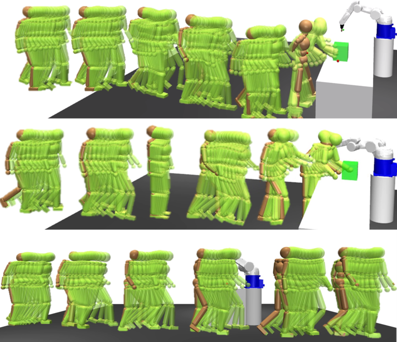

*Mohamed El-Shamouty and Anish Pratheepkumar*

The IEEE 26th International Conference on Emerging Technologies and Factory Automation (ETFA), accepted June 2021.

[Paper]( https://ieeexplore.ieee.org/document/9613465)

[Code](https://github.com/anish-pratheepkumar/prednet)
 

---

## Abstract

 Human-Robot Interaction (HRI) is becoming increasingly viable for flexible and resilient manufacturing, combining the intelligence and dexterity of humans with the precision and strength of robots. However, HRI incurs the breakage of wellestablished safety procedures and requires robots to be aware of their environment, especially their human co-workers. This calls
for human motion prediction, which can improve the performance in HRI scenarios and contribute towards safer HRI. In this regard, we propose PredNet, a simple recurrent neural network architecture designed to predict human motion in a prediction window of 1 second. To address the lack of production-related HRI scenarios for training and validating PredNet, we develop simple HRI scenarios in a simulation environment, consisting of the following human actions: walking, lifting boxes and wiping. For a real world validation, we use Mogaze dataset. Furthermore, we propose a novel metric, namely, Volumetric Occupancy Error (VOE) towards measuring the safety performance of motion prediction architectures aimed to be applied in industrial settings. On both HRI scenarios and Mogaze datasets, PredNet performs
better than baseline RED architecture. 

